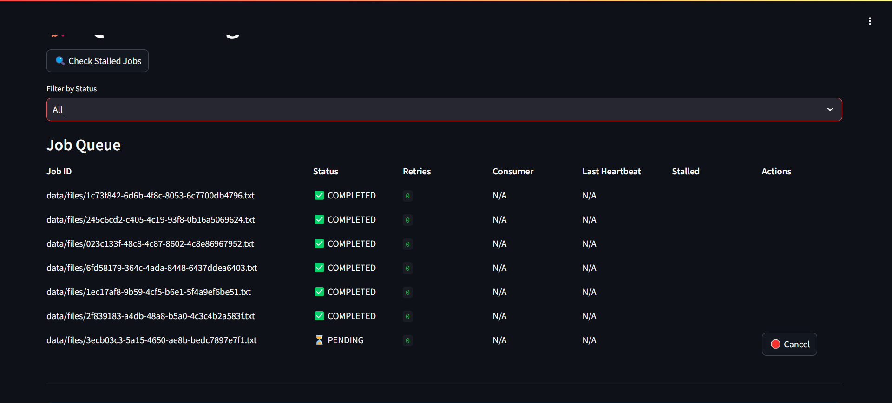
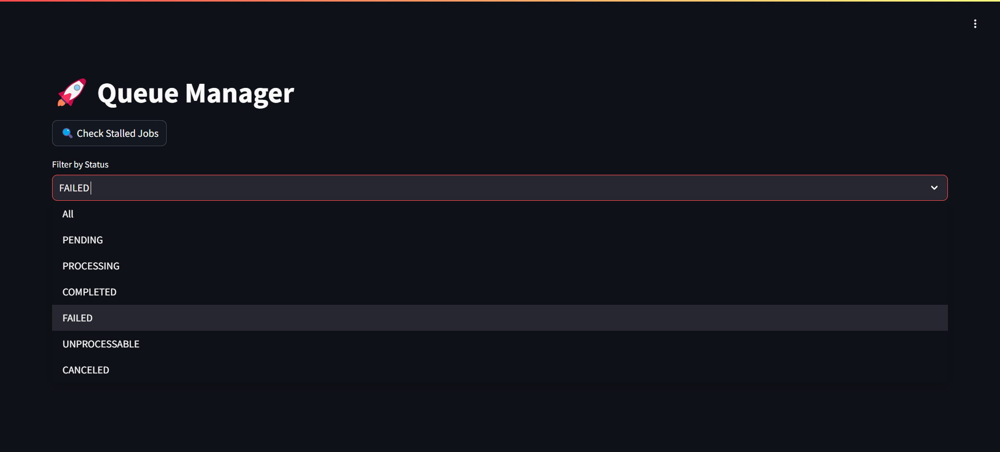
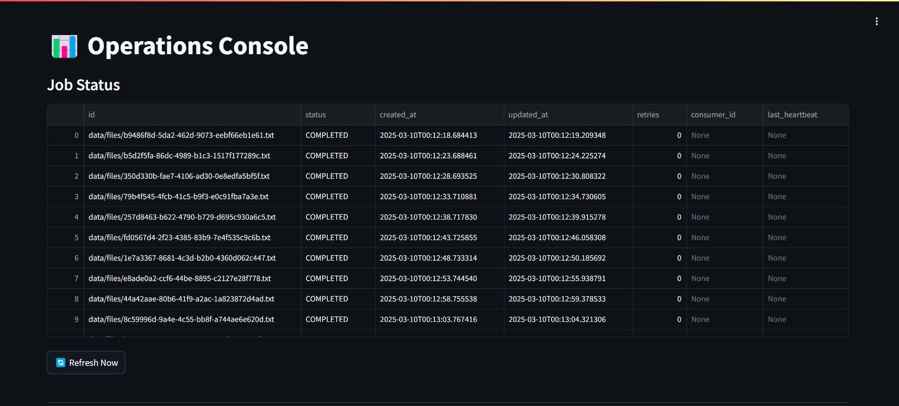

# Persistent Queue Project

## Overview

Welcome to the Persistent Queue Project! This system is designed to handle tasks efficiently and reliably, even if something goes wrong. Think of it as a smart to-do list that ensures every task gets done, no matter what.

## What You Need

- A computer with internet access.
- Basic knowledge of using the command line (don't worry, we'll guide you!).

## Setting Up the Project

### Step 1: Open Your Terminal

First, open your terminal or command prompt. This is where you'll type all the commands to get the project up and running.

### Step 2: Navigate to the Project Folder

Type the following command to go to the project folder:

```bash
cd ~/bootcamp-srinivas/persistent_queue_project
```

### Step 3: Install Dependencies

Next, you'll need to install some tools and libraries that the project depends on. Run these commands one by one:

```bash
pip install --user poetry
poetry install --with dev
poetry env activate
```

**Note:** The `poetry env activate` command activates a virtual environment, which is like a safe space for the project to run without affecting other parts of your computer.

### Step 4: Create Necessary Folders

The project needs some folders to store data and logs. Run this command to create them:

```bash
mkdir -p data/files logs && chmod 777 data/files logs
```

## Running the Application

### Starting the Workers

The workers are the ones who process the tasks. Start them by running:

```bash
poetry run supervisord -c supervisord.conf
```

### Launching the Manager UI

The Manager UI lets you control and manage the tasks. Start it with:

```bash
poetry run python -m streamlit run src/ui/manager.py
```

- **Access the Manager UI**: Open your web browser and go to [http://localhost:8501](http://localhost:8501).
- **Login Credentials**: Use `admin123` as the password.

### Launching the Operations (Ops) UI

The Ops UI allows you to monitor the progress of the tasks. Start it with:

```bash
poetry run python -m streamlit run src/ui/ops.py
```

- **Access the Ops UI**: Open your web browser and go to [http://localhost:8502](http://localhost:8502).

## Screenshots

### Manager UI Displaying Job Queue and Actions

  
_View job details, retries, and take actions like resubmit or cancel._

### Filtering Jobs by Status in Manager UI

  
_Select a status to view specific jobs in the Manager UI._

### Ops UI Monitoring Job Progress in Real Time

  
_Monitor live job statuses and worker activity._

## How It Works

Here’s a simple explanation of how everything fits together:

```
+----------------+       +----------------+       +----------------+
|   Producer     | ----> | Persistent     | <---- |   Consumers    |
| (Adds Tasks)   |       | Queue (SQLite) |       | (Do the Work)  |
+----------------+       +----------------+       +----------------+
                           |         |
                           v         v
+----------------+       +----------------+
|   Manager UI   | <---- |    Ops UI      |
| (You’re in Charge)    | (Watch Progress)|
+----------------+       +----------------+
```

---

**1. Producer**: Adds jobs (e.g., files) to the queue every 5 seconds with a unique ID like `data/files/abc123.txt`.

**2. Persistent Queue (SQLite)**: Stores jobs, tracks status (`PENDING`, `PROCESSING`, `COMPLETED`, etc.), and ensures nothing’s lost if the system crashes. Uses SQLite for reliability.

**3. Consumers**: Workers (up to 10) grab jobs and process them:

- **Start**: `PENDING` → `PROCESSING`.
- **Work**: Add timestamps to files, send heartbeats every ~1s during long jobs.
- **Finish**: `COMPLETED` or retry 3x on failure (e.g., missing file), then `UNPROCESSABLE`.

**4. Heartbeat Mechanism**: Workers ping the queue every ~1s while working. If one crashes or hangs (e.g., 1 of 10 dies), heartbeats stop. After 30s, the queue marks the job `PENDING` again—another worker takes over. No job gets stuck.

**5. Failed Job Defined**: A job “fails” if it can’t finish—like a missing file. It retries 3x (1s, 2s, 4s delays). If all retries flop, it’s `UNPROCESSABLE`—done trying, flagged for review. UI shows retries climb, status shift.

**6. Crash/Hang Handling**: If a worker crashes (e.g., `kill -9`) or hangs (no heartbeat), the queue’s heartbeat check (every 10s) spots it. Jobs stalled >30s go back to `PENDING`. Supervisor restarts crashed workers—system keeps rolling.

**7. Manager UI**: Log in, see all jobs live (refreshes every 5s):

- **Status**: `PENDING`, `PROCESSING`, `COMPLETED`, `UNPROCESSABLE`.
- **Details**: Worker ID, heartbeats, retries.
- **Actions**: Resubmit failed jobs, cancel unwanted ones.
- **Crash proof**: Shows `Stalled` → `PENDING` if a worker dies.

**8. Ops UI**: Monitors jobs moving `PENDING` → `PROCESSING` → `COMPLETED`, with worker and heartbeat updates.

### In Action

The Producer adds a job. It sits in the Queue as `PENDING`. A Consumer picks it up, marks it `PROCESSING`, and sends heartbeats while working. If it crashes, the Queue requeues it after 30 seconds. Once done, it’s `COMPLETED`—all visible in the UIs. Simple, tough, and reliable.

## Stopping the Application

To stop the application, simply press `Ctrl + C` in the terminal where each service is running.

## Troubleshooting

### Nothing Happens?

If nothing seems to be working, check the logs in the `logs/` directory. For example, you can look at `logs/producer.log` to see if there are any errors.

### Cannot Log In?

Make sure you are using the correct password: `admin123`.

### Still Facing Issues?

Run the following command to check if everything is set up correctly:

```bash
poetry run pytest tests/ -v
```

---

### FAQ and Feedback Addressed

1. **What happens if a consumer crashes while processing a task?**

   - The heartbeat system ensures tasks aren’t lost. Workers send a heartbeat every ~1 second while processing a task to say, “I’m still here.”
   - A separate queue check runs every 10 seconds to spot any workers that stop responding (e.g., due to a crash). If a task’s heartbeat is older than 30 seconds, it’s reset to PENDING, and another worker picks it up.
   - If a consumer crashes (e.g., terminated unexpectedly), its task is marked `PENDING` again after 30 seconds, allowing another worker to take over.
   - **Ensures no task is left incomplete.**
   - **Feedback: Crash/Hang Logic Missing – Resolved**: The heartbeat mechanism and automatic worker restarts by Supervisor ensure seamless recovery.
   - **Test**: Use `kill -9 <consumer_pid>`—watch the UI shift from `PROCESSING` to `PENDING` within ~30-40 seconds, with logs noting "Checked and requeued stalled jobs."

2. **How does the system handle tasks that repeatedly fail?**

   - If a task fails (e.g., due to a missing file), it retries up to 3 times with increasing delays (1s, 2s, 4s).
   - After the third failure, it’s marked `UNPROCESSABLE` and flagged for review—no endless loops.
   - **Feedback: Definition of Failed Job Not Clear – Resolved**: A failed task is one that can’t complete, retries 3 times, then becomes `UNPROCESSABLE`. The UI and logs show retries and status changes clearly.
   - **Test**: Delete a file—see retries climb to 3, then `UNPROCESSABLE`.

3. **Can I use a different database instead of SQLite?**

   - Yes! The `get_queue()` function makes it easy to swap SQLite for another backend, like Redis, with minimal changes—just update that function.

4. **What if the entire system crashes?**

   - Tasks are safely stored in SQLite.
   - Restart with `./run.sh`, and it resumes right where it stopped—no data lost.

5. **How do I add more workers?**

   - Edit `supervisord.conf` and adjust `numprocs` (e.g., `numprocs=10`).
   - More workers start automatically and restart if they fail.

6. **Does it work as intended?**
   - Absolutely—tasks flow from `PENDING` to `PROCESSING` to `COMPLETED`, with retries for failures and recovery from crashes, all visible in the UI and logs.
   - **Feedback: Doesn’t Work as Designed – Resolved**: The latest updates to `consumer.py`, `sqlite_backend.py`, and `manager.py` ensure full functionality.
   - **Test**: Run `./run.sh`, crash a worker—UI and logs confirm the system recovers and completes tasks as designed.

---
