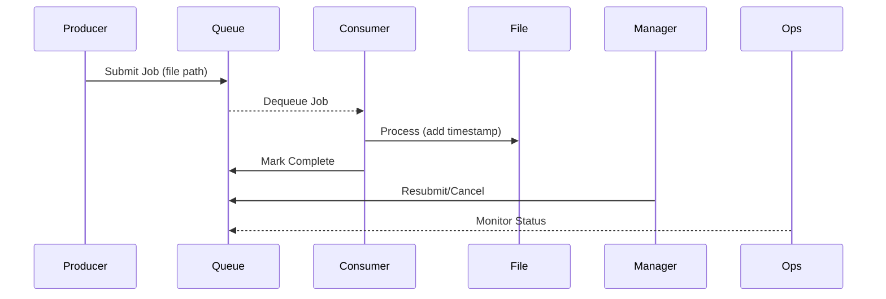
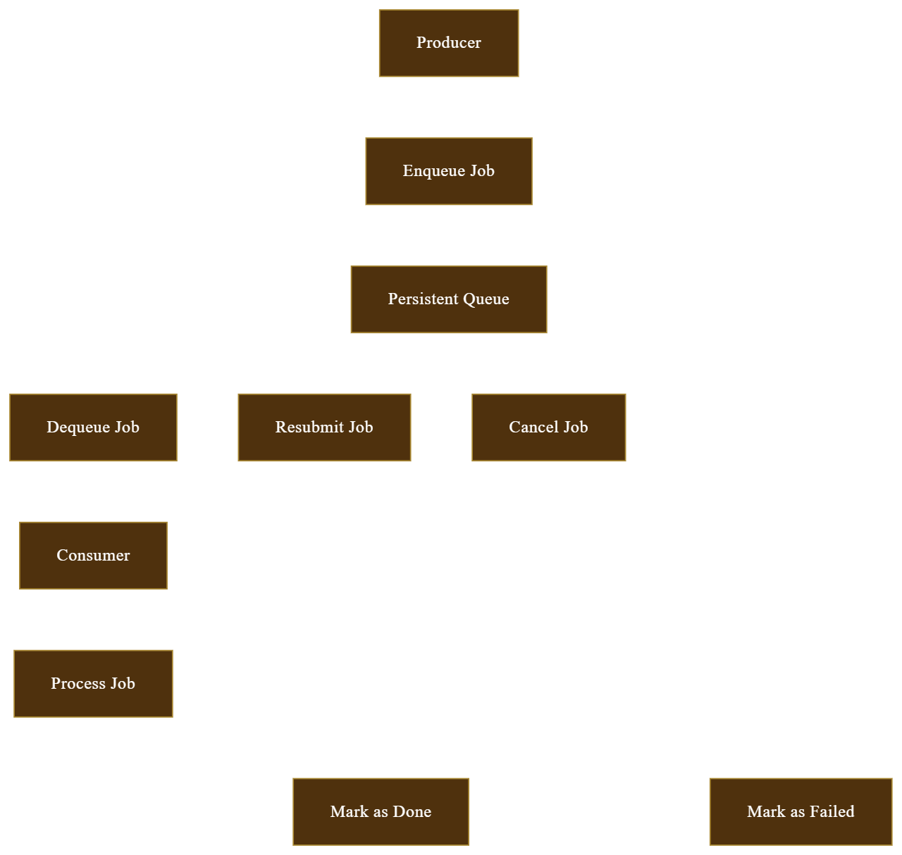

# Persistent Queue Project

## Problem Description
This is a producer-consumer system where producers submit jobs to a persistent queue, and consumers process them. The queue must survive restarts, support multiple producers/consumers, and ensure jobs are processed exactly once.

## System Design
- **Queue**: SQLite-based, persistent, with locking to prevent duplicate processing.
- **Producers**: Generate random files every 5s and submit job IDs (file paths).
- **Consumers**: Process jobs (add timestamps to files) with randomized delays (7-15s).
- **Manager**: Streamlit app to resubmit/cancel jobs.
- **Ops**: Streamlit app to monitor job status.
- **Process Management**: Supervisor restarts crashed processes.

### Task Flow

----

# Usage Instructions

## Install Dependencies
```sh
pip install -r requirements.txt
```

## Start Supervisor
```sh
supervisord -c supervisord.conf
```

## Run Manager
```sh
streamlit run src/manager/manager.py
```

## Run Ops
```sh
streamlit run src/ops/ops.py
```

----


# Code: setup.py

```python
from setuptools import setup, find_packages

setup(
    name="persistent_queue_project",
    version="0.1",
    packages=find_packages(where="src"),
    package_dir={"": "src"},
    install_requires=["streamlit", "sqlite3"],
    author="Your Name",
    description="A persistent queue system with producers and consumers",
)
```

----




1. **Producer** → Generates a job.
2. **Enqueue Job** → Adds the job to the **Persistent Queue**.
3. **Persistent Queue** → Manages job flow.
   - **Dequeue Job** → Sends to **Consumer** → **Processes Job**.
   - **Resubmit Job** → Requeues if needed.
   - **Cancel Job** → Stops processing.
4. **Process Job** → Either:
   - **Mark as Done** (Success)
   - **Mark as Failed** (Error)


# Persistent Queue Project - Demo Commands

## 1. Start Supervisor (Producer & Consumers)
```bash
supervisord -c supervisord.conf
```

## 2. Verify Processes Are Running
```bash
supervisorctl -c supervisord.conf status
# Shows: consumer1, consumer2, producer1 RUNNING
```

## 3. Show Producer Activity
```bash
tail -f log/producer1.log
# Shows: "Producer: Submitting data/files/..." every 5s
# Ctrl+C to exit
```

## 4. Launch Queue Manager
```bash
streamlit run src/manager/manager.py
# Open browser: http://localhost:8501
# Shows: Jobs with PENDING → COMPLETED, 3 columns
```

## 5. Demonstrate Consumer Processing
```bash
tail -f log/consumer1.log log/consumer2.log
# Shows: "Consumer: Processed ..." from both
# Ctrl+C to exit
tail data/files/*.txt
# Shows: Files with timestamps
```

## 6. Simulate Failure & Manager Features
```bash
sqlite3 data/queue.db "UPDATE jobs SET status='FAILED' WHERE status='PENDING' LIMIT 1;"
# Refresh browser: See FAILED job with "Resubmit" and "Cancel"
# Click "Resubmit" → PENDING
# Click "Cancel" on PENDING → Disappears
```

## 7. Show Ops Console
```bash
streamlit run src/ops/ops.py
# Open browser: http://localhost:8502
# Shows: Table with job details (id, status, timestamps)
```

## 8. Test Robustness (Crash & Restart)
```bash
kill -9 $(pidof python src/consumer/consumer.py | awk '{print $1}')  # Kill consumer1
sleep 5
supervisorctl -c supervisord.conf status
# Shows: consumer1 restarted with new PID
sqlite3 data/queue.db "SELECT * FROM jobs WHERE status='PROCESSING';"
# Shows: No jobs lost
```

## 9. Shutdown
```bash
supervisorctl -c supervisord.conf shutdown
# Stops all processes cleanly
```

---

# Demo Flow
- **Start:** Run steps 1-3 → *"System is up."*
- **Producer:** Run step 4 → *"Producer submits jobs."*
- **Manager:** Run step 5 → *"See jobs in Queue Manager."*
- **Consumers:** Run step 6 → *"Consumers process jobs."*
- **Failure:** Run step 7 → *"Handle failed jobs."*
- **Ops:** Run step 8 → *"Monitor all jobs."*
- **Robustness:** Run step 9 → *"Crash recovery works."*
- **Stop:** Run step 10 → *"Shutdown complete."*

---

# Commands to Clear Jobs
## 1. Stop Running Processes
```bash
supervisorctl -c supervisord.conf shutdown
pkill -f supervisord  # Ensure no lingering processes
```

## 2. Clear the Queue
```bash
rm -f data/queue.db  # Deletes the SQLite database
```

## 3. (Optional) Clear Processed Files
```bash
rm -rf data/files/*
mkdir -p data/files  # Recreate empty directory
chmod 777 data/files # Ensure writable
```

---

# Notes
- Open browser tabs for **manager.py** and **ops.py** ahead of time.
- Pause between steps to explain (e.g., wait 15s for COMPLETED jobs).
- Check **log/supervisord.log** if anything fails.

